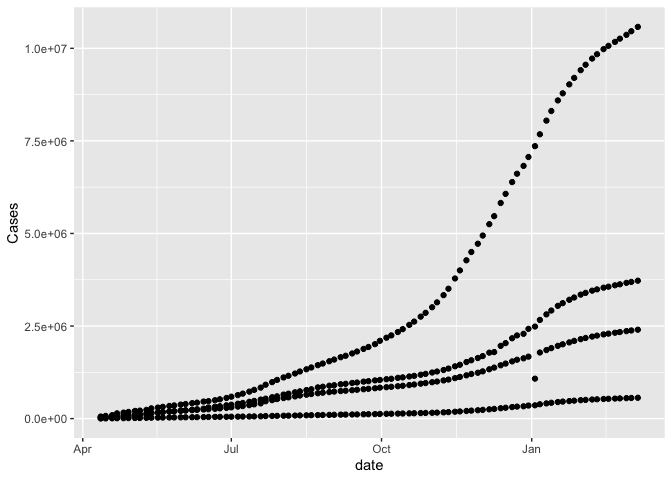
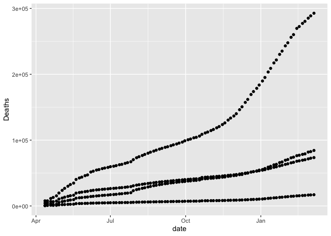

# Week 02: COVID Visualization Activity
**`[[`**Your Name**`]]`**
2024-01-24

Today, we’ll be working with a data set related to COVID. This data is
based on data from the the [COVID Tracking
Project](https://covidtracking.com/). I cleaned up this data and also
added total populations from the 2020 for each of the relevant
categories. Note, due to differences in the way race and ethnicity are
encoded in the census as compared to the the COVID Tracking Project, the
population counts for LatinX may be somewhat inaccurate.

``` r
suppressPackageStartupMessages(library(tidyverse))
print(load("CRDT Data.RData"))
```

    [1] "covid_data_count"  "covid_data_long"   "covid_data_orig"  
    [4] "covid_data_race"   "covid_data_simple"

I’ve included 5 different data sets. The data `covid_data_count`,
`covid_data_long`, `covid_data_orig`, and `covid_data_race` all have the
same data but have it represented in different ways.

The `covid_data_simple` has a substantially simplified version of the
data. (Within a few weeks you’ll be able to create each of these data
sets from the `covid_data_orig` file yourself.)

Start by exploring

``` r
ggplot(covid_data_simple, aes(x = date, y = Cases)) + geom_point()
```



If you want to only look at a specific state, you can do it like this.
For now, see what you can do just using `ggplot`.

``` r
covid_data_count |> 
  filter(state == "MA") |> 
  ggplot(aes(x = date, y = Cases, color = race)) + geom_line()
```


## Exercise for Friday

**Goal** Make a plot showing the cumulative number of deaths per 100,000
people across time among each race group in the `covid_data_simple`. You
only need to use `ggplot`. To get started, you can use this code block.

``` r
ggplot(covid_data_simple, aes(x = date, y = Deaths)) + geom_point()
```



Comment on the disparities between the race groups.

**If you finish**

Either

- Work to polish and improve the the plot you created by incorporating
  titles, better labels, scales, annotations, etc.

or

- Try to create your own plot. Write code for a plot and describe what
  you observe. Are there any conclusions you can draw?
